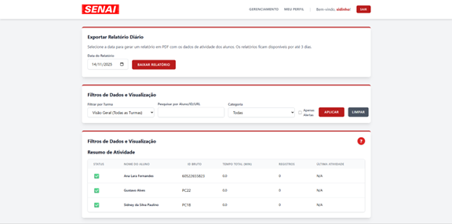
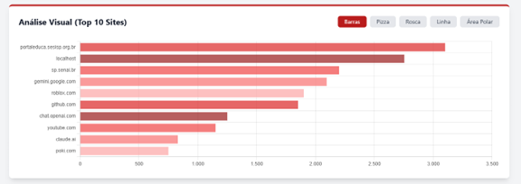
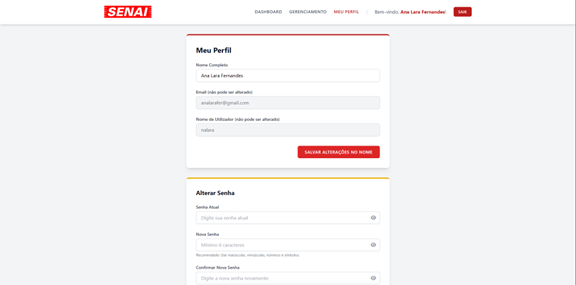

# V.O.C.E – Visualização e Observação do Comportamento Estudantil


---

## 📌 Visão Geral

O **V.O.C.E (Visualização e Observação do Comportamento Estudantil)** é um projeto de conclusão de curso desenvolvido no **SENAI-SP**, com o objetivo de apoiar professores no acompanhamento e análise do uso da internet por alunos em ambientes educacionais.

A plataforma realiza a coleta de dados de navegação, a classificação automática dos acessos por categoria e a visualização dessas informações por meio de um **dashboard interativo**, auxiliando na análise pedagógica e na tomada de decisões educacionais.

---
## 📸 Demonstração Visual do Sistema

A seguir, são apresentadas algumas telas do **dashboard do professor**, destacando as principais funcionalidades do sistema V.O.C.E.

### 📊 Relatórios e Monitoramento de Atividades
Visualização dos dados de navegação dos alunos, com filtros por turma, categoria e período, além da exportação de relatórios.



---

### 👥 Gestão de Turmas e Alunos
Interface destinada à administração de turmas, permitindo adicionar, editar ou remover alunos de forma prática.


---

### 📈 Análise Visual dos Dados
Gráficos interativos que apresentam os sites mais acessados, auxiliando na análise do comportamento de navegação.



---

### 👤 Perfil do Usuário
Tela de gerenciamento do perfil do professor, incluindo atualização de dados pessoais e alteração de senha.



---

## 🎓 Contexto Acadêmico

- **Tipo de Projeto:** Trabalho de Conclusão de Curso (TCC)  
- **Instituição:** SENAI-SP  
- **Curso:** Técnico em Desenvolvimento de Sistemas  

### 👥 Autores
- Ana Lara Fernandes da Silva  
- Gustavo Emanuel Alves  
- Sidney da Silva Paulino  

### 👨‍🏫 Orientadores
- Leonardo Gomes  
- Anderson Roberto  

---

## 👩‍💻 Contribuição Individual

Neste projeto, minha atuação concentrou-se principalmente em:

- Desenvolvimento do **backend** utilizando Node.js e Express.js  
- Implementação da **lógica de negócio** e das rotas da aplicação  
- Integração do sistema com o **banco de dados MySQL/MariaDB**  
- Apoio na comunicação em tempo real entre backend e dashboard  
- Participação no planejamento e estruturação geral da solução  

---

## 🧩 Descrição Funcional do Sistema

O sistema é composto por três componentes principais:

1. **Extensão de Navegador**  
   Responsável pela coleta dos dados de navegação dos alunos.

2. **Servidor Backend**  
   Centraliza o processamento das informações, comunicação em tempo real e persistência dos dados.

3. **Dashboard Web**  
   Interface utilizada pelos professores para visualização de relatórios, logs e métricas de navegação.

---

### 🎥 Demonstração em Vídeo

Para facilitar a compreensão prática do funcionamento do sistema, foi disponibilizado um vídeo demonstrativo apresentando o **dashboard do professor**, incluindo a visualização dos dados de navegação, categorização dos acessos e atualização em tempo real.

📌 **Vídeo de demonstração (Canva):**  
👉 https://www.canva.com/design/DAG4nJSdVzM/OmZGjSj9r-_h916IGkD6Fw/watch?authuser=0

> ℹ️ *O vídeo está hospedado no Canva e pode solicitar login para visualização, dependendo da configuração de acesso do usuário.*

O vídeo apresenta o fluxo completo da aplicação, desde o acesso ao dashboard até a análise das informações coletadas, proporcionando uma visão clara da solução desenvolvida.

---

## 🚀 Arquitetura e Destaques Técnicos

O V.O.C.E foi desenvolvido com uma arquitetura **Full Stack**, integrando diferentes tecnologias para garantir desempenho, segurança e escalabilidade.

### 1. Classificação Inteligente de URLs

- Implementação de um modelo de **Deep Learning** utilizando **TensorFlow** e **Keras**.  
- Utilização de uma **CNN híbrida**, analisando URLs em nível de caracteres e palavras.  
- Classificação automática dos acessos em categorias como educacional, redes sociais e entretenimento.  
- Implementação de um **mecanismo de fallback**, garantindo funcionamento mesmo em cenários de falha do modelo principal.

### 2. Comunicação e Processamento em Tempo Real

- Atualização instantânea do dashboard por meio de **Socket.IO (WebSockets)**.  
- Comunicação segura entre a extensão do navegador e o sistema operacional via **Native Messaging**, implementado em Python.  
- Utilização de **processamento em lote (batch processing)** para otimização do tráfego de dados.

---

## 🛠️ Tecnologias Utilizadas

| Camada | Tecnologias |
|------|------------|
| **Backend** | Node.js, Express.js, Socket.IO |
| **Inteligência Artificial** | Python, TensorFlow, Keras, scikit-learn |
| **Banco de Dados** | MySQL / MariaDB |
| **Frontend** | EJS (SSR), Tailwind CSS |
| **Extensão de Navegador** | Manifest V3, Native Messaging |

---

## 🔒 Segurança e Proteção de Dados

O desenvolvimento do V.O.C.E seguiu boas práticas de segurança da informação e princípios alinhados à **Lei Geral de Proteção de Dados (LGPD)**.

### Medidas adotadas

- **Anonimização:** Utilização de identificadores técnicos no lugar de dados pessoais sensíveis.  
- **Criptografia de Senhas:** Armazenamento seguro utilizando **bcrypt**.  
- **SQL Parametrizado:** Prevenção contra ataques de **SQL Injection**.  
- **Isolamento de Dados:** Garantia de que cada professor tenha acesso apenas às informações de suas turmas.

---

## 📦 Recursos de Terceiros

Para o treinamento do modelo de classificação de URLs, foi utilizado o conjunto de vetores pré-treinados:

- **GloVe (glove6b100.txt)**  
  Recurso público amplamente utilizado em aplicações de Processamento de Linguagem Natural.  
  🔗 https://nlp.stanford.edu/projects/glove/

---

## 🛠️ Instalação e Execução

### Pré-requisitos
- Node.js (v18 ou superior)  
- Python (v3.8 ou superior)  
- MySQL ou MariaDB  
- npm e pip  

### Backend
```bash
cd V.O.C.E-main/monitor-backend
npm install
pip install -r requirements.txt
